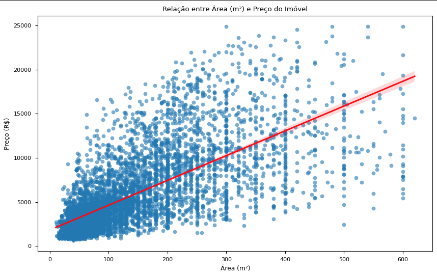
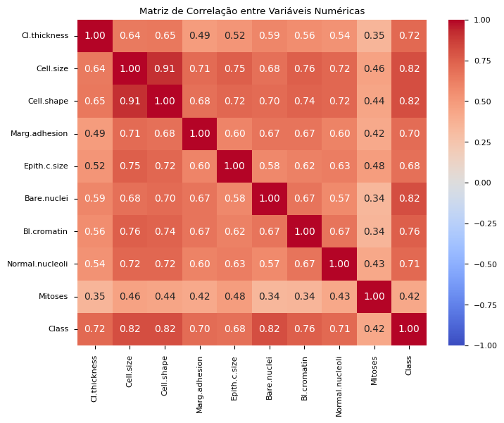

# Codigos-de-Regressão-Linear-e=Logística
Atividade de alugueis: [Código](./aluguel_linear.ipynb)

Coeficientes do modelo: 

```bash
                    Modelo      R²     MAE (R$)    RMSE (R$)
Regressão Linear Básica  0.6024  R$ 1,995.30  R$ 2,857.76
```



---

Atividade de Câncer de Mama: [Código](./breast_log.ipynb)

Coeficientes do modelo: 

```bash
                Modelo      R²   MAE  RMSE
Regressão Logística  0.8363  0.04  0.19
```

